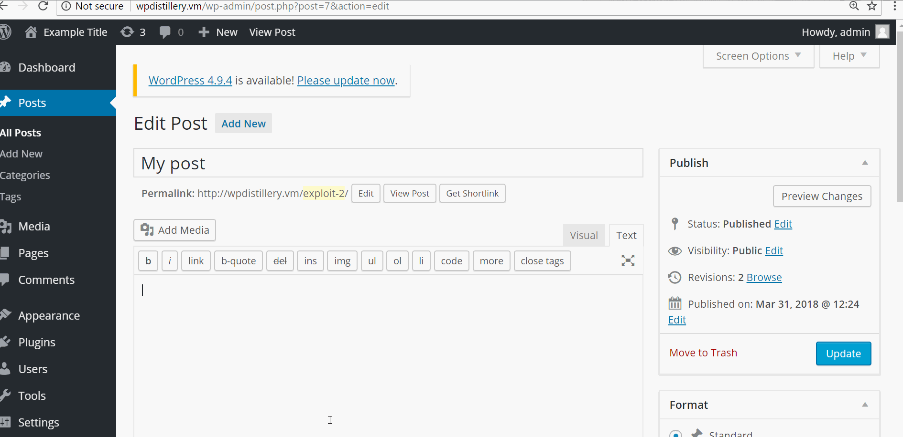
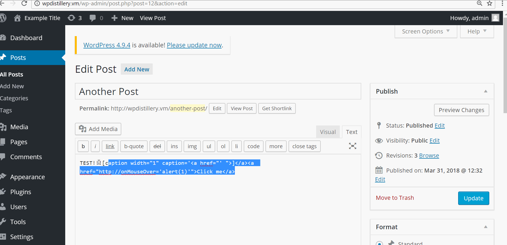

# Project 7 - WordPress Pentesting

Time spent: 10 hours spent in total

> Objective: Find, analyze, recreate, and document **five vulnerabilities** affecting an old version of WordPress

## Pentesting Report

1. (Required) Authenticated Stored Cross-Site Scripting (XSS)
  - [x] Summary: 
    - Vulnerability types: XSS
    - Tested in version: 4.2
    - Fixed in version:  4.2.3
  - [x] GIF Walkthrough:
  
  
  - [x] Steps to recreate: 
  1. Write a Javascript like this: <a href="[caption code=">]</a><a title=" onmouseover=alert('XSS')  ">link</a>
  2. Create a new post and put it inside of it
  3. Publish and mouseover the link
  - [x] Affected source code:
    - [Link 1](https://core.trac.wordpress.org/changeset?sfp_email=&sfph_mail=&reponame=&old=33316%40branches%2F4.2&new=33316%40branches%2F4.2&sfp_email=&sfph_mail=p)

2. (Required) Authenticated Shortcode Tags Cross-Site Scripting (XSS)
  - [x] Summary: 
    - Vulnerability types: XSS
    - Tested in version: 4.2
    - Fixed in version: 4.2.5
  - [x] GIF Walkthrough: 
  
  
  - [x] Steps to recreate: 
   1. Write TEST!!![caption width="1" caption='<a href="' ">]</a><a href="http://onMouseOver='alert(1)'">Click me</a> in a post
   2. Publish post and mouseover "Click me"
  - [x] Affected source code:
    - [Link 1](https://core.trac.wordpress.org/browser/tags/version/src/source_file.php)

3. (Required) Unauthenticated Stored Cross-Site Scripting (XSS)
  - [x] Summary: 
    - Vulnerability types:
    - Tested in version: 4.2
    - Fixed in version: 4.2.1
  - [x] GIF Walkthrough: 
  
  
  - [x] Steps to recreate: 
  1. Post a comment with the javascript ""
  2. Replace the AAAAAA with 64 kb of text
  3. Mouseover the comment
  - [x] Affected source code:
    - [Link 1](https://core.trac.wordpress.org/browser/tags/4.2.1/src/wp-includes/kses.php)

## Assets

List any additional assets, such as scripts or files
1. [Authenticated Stored Cross-Site Scripting (XSS)](https://wpvulndb.com/vulnerabilities/8111)
2. [Authenticated Shortcode Tags Cross-Site Scripting (XSS)](https://wpvulndb.com/vulnerabilities/8186)

## Resources

- [WordPress Source Browser](https://core.trac.wordpress.org/browser/)
- [WordPress Developer Reference](https://developer.wordpress.org/reference/)

GIFs created with [LiceCap](http://www.cockos.com/licecap/).

## Notes

Describe any challenges encountered while doing the work

Downloading everything took ages, and whenever vagrant didn't work, it decided to explode. I also had issues getting wpscan to actually work for a while. It was difficult all of a sudden doing pentesting for real when we weren't taught how to do it in class and we were sort of overwhelmed with information and links.

## License

    Copyright [yyyy] [name of copyright owner]

    Licensed under the Apache License, Version 2.0 (the "License");
    you may not use this file except in compliance with the License.
    You may obtain a copy of the License at

        http://www.apache.org/licenses/LICENSE-2.0

    Unless required by applicable law or agreed to in writing, software
    distributed under the License is distributed on an "AS IS" BASIS,
    WITHOUT WARRANTIES OR CONDITIONS OF ANY KIND, either express or implied.
    See the License for the specific language governing permissions and
    limitations under the License.
